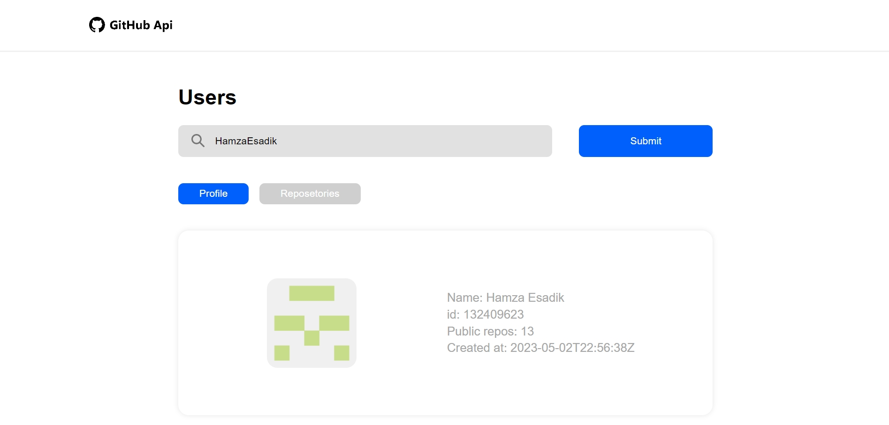
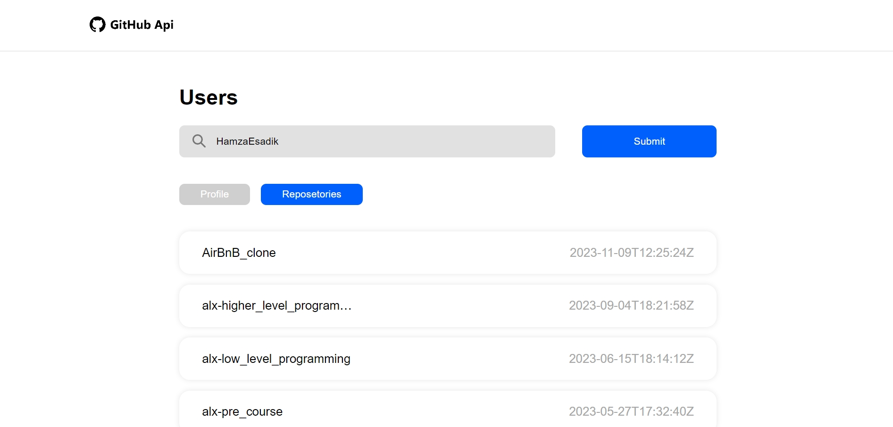

## Just practicing some Vue JS basics.
### About The Project:
1- Enter a GitHub username and click on submit.
2- then the page will load some informations about your profile and your repositories

